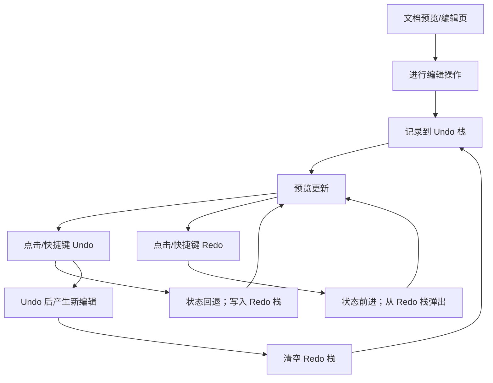

## 1. Product Overview
为现有文档预览/编辑界面增加“撤回/取消撤回（Undo/Redo）”能力，并将其集成到控制面板（control panel）中。
该控制面板需像 Word 一样固定放在 document preview 上方，提升编辑效率与可预期性。

## 2. Core Features

### 2.1 Feature Module
本次需求涉及以下核心页面：
1. **文档预览/编辑页**：文档预览区域、顶部控制面板（含 Undo/Redo）、编辑操作历史管理。

### 2.3 Page Details
| Page Name | Module Name | Feature description |
|-----------|-------------|---------------------|
| 文档预览/编辑页 | 顶部控制面板（位于预览上方） | 显示并承载 Undo/Redo 操作入口；在页面结构上位于 document preview 上方，视觉与交互类似 Word 工具栏（水平排布、清晰分组）。 |
| 文档预览/编辑页 | Undo（撤回） | 撤回最近一次可撤回的编辑操作；当无可撤回操作时置灰/禁用；支持快捷键触发（如 Ctrl+Z）。 |
| 文档预览/编辑页 | Redo（取消撤回） | 取消最近一次撤回的操作（前进）；当无可前进操作时置灰/禁用；支持快捷键触发（如 Ctrl+Y / Ctrl+Shift+Z，具体以项目既定为准）。 |
| 文档预览/编辑页 | 历史栈管理 | 在用户每次产生“可撤回”的编辑变更时记录到历史栈；执行 Undo/Redo 时正确回放状态；新编辑发生在 Undo 之后时清空 Redo 栈（符合常见编辑器行为）。 |
| 文档预览/编辑页 | 文档预览联动 | Undo/Redo 触发后，document preview 立即反映对应状态（内容、排版/标注等以项目现有数据结构为准）。 |

## 3. Core Process
### 用户主流程（单一角色）
1. 你在文档预览/编辑页进行编辑操作（产生可撤回的变更）。
2. 系统将该变更记录到 Undo 历史栈，并更新控制面板中 Undo/Redo 的可用状态。
3. 你点击控制面板的 Undo（或使用快捷键）撤回最近一次操作；系统将当前状态移动到 Redo 栈，并回退到上一个状态。
4. 你点击 Redo（或使用快捷键）恢复刚才撤回的操作；系统从 Redo 栈前进，并同步更新预览。
5. 若你在 Undo 后进行新的编辑操作，系统清空 Redo 栈，确保历史分支行为符合常见编辑器体验。

