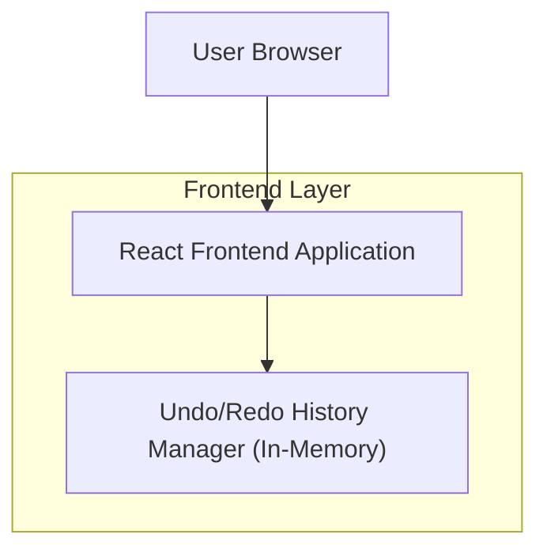

## 1.Architecture design

## 2.Technology Description
- Frontend: React@18 + vite + tailwindcss@3
- Backend: None

## 3.Route definitions
| Route | Purpose |
|-------|---------|
| /document | 文档预览/编辑页；顶部 control panel 位于 document preview 上方，提供 Undo/Redo，并驱动预览状态变化 |

## 6.Data model(if applicable)
### 6.1 Data model definition
（本需求不强制引入数据库）

- HistoryState：当前用于渲染 document preview 的状态快照（或可重放的操作序列，取决于项目既有实现）。
- UndoStack：HistoryState[]（或 Operation[]）
- RedoStack：HistoryState[]（或 Operation[]）

关键规则：
- 每次产生新的可撤回编辑：push 到 UndoStack，清空 RedoStack。
- Undo：从 UndoStack 弹出并回退到上一状态，同时将当前状态 push 到 RedoStack。
- Redo：从 RedoStack 弹出并前进，同时将当前状态 push 回 UndoStack。

### 6.2 Data Definition Language
无（不涉及数据库表）。
